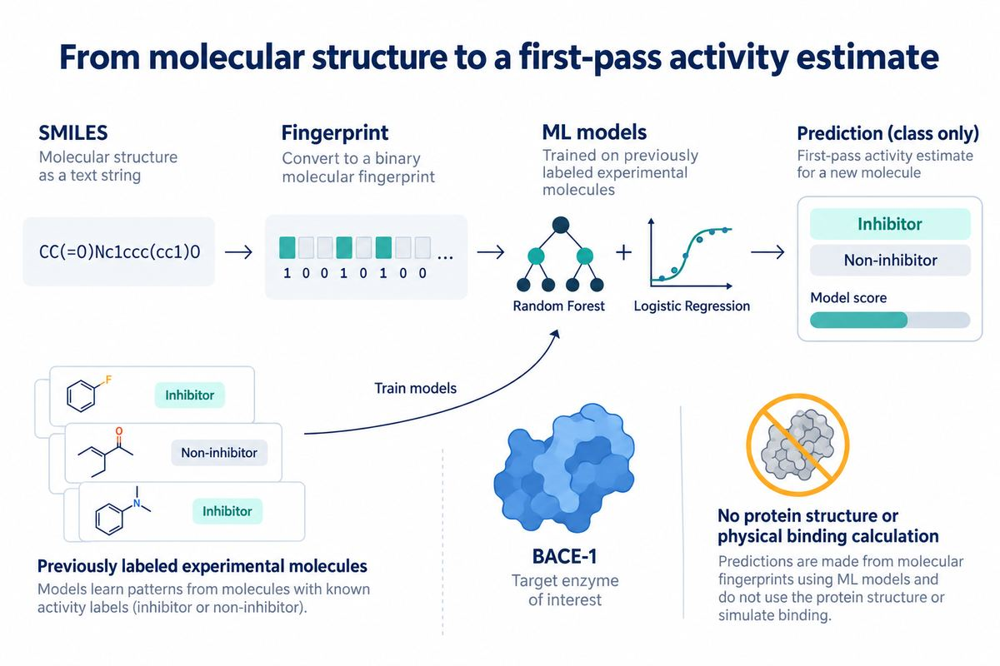

# MolML-Pipeline



<p align="center">
  <a href="https://share.streamlit.io/deploy?repository=jjimenezgar/MolML-Pipeline&branch=main&mainModule=app.py">
    
  </a>
</p>

**A small, reproducible machine-learning project that learns to distinguish molecules reported as BACE-1 inhibitors from those reported as non-inhibitors.**

It demonstrates a complete workflow—from published experimental data to a tested, runnable prediction service—using established methods. It is an engineering and learning project, not a new drug-discovery method.

The optional Streamlit demo lets you enter a molecule as SMILES, view the model's estimate, and inspect how similar it is to the training chemistry. It runs the model inside the Streamlit app; no separate API service is needed. Click the badge above to deploy your own instance on Streamlit Community Cloud, or run it locally:

```bash
pip install -r requirements.txt
streamlit run app.py
```

The first launch downloads the checksum-verified BACE benchmark and fits the selected baseline. The prediction score is not a measured probability of binding; see [Project boundaries](#project-boundaries).

## The question

**Given the chemical structure of a molecule, can a computer estimate whether it belongs to the inhibitor or non-inhibitor class in the BACE dataset?**

BACE-1 (also called beta-secretase 1) is a human enzyme studied in biomedical research. The MoleculeNet BACE dataset contains 1,513 molecules with binary labels based on reported experimental activity: **1 means inhibitor; 0 means non-inhibitor**. The model does not receive the protein structure and does not calculate whether a molecule physically fits or binds to the protein.

## How it works

1. **Input:** A molecule is written as a SMILES string, a compact text notation for chemical structures.
2. **Check and encode:** RDKit checks whether the SMILES describes a valid molecule and converts it into a Morgan fingerprint—a 2,048-bit summary of structural features.
3. **Learn:** Two standard models, Logistic Regression and Random Forest, learn patterns that distinguish the two labelled groups.
4. **Predict:** For a new SMILES, the program returns a predicted class and a model score, plus diagnostics about similarity to the training molecules and whether its central scaffold was seen before.

The score is a model output, **not a measured chance of binding**. A high score does not prove inhibition, safety, or usefulness as a medicine. The prediction is best treated as a first-pass estimate to help decide what might merit further study.

## How we check it

We reserve separate molecules for training, validation, and final testing. The final test set is held out from model fitting and model selection.

We evaluate two kinds of split:

- **Random split:** molecules are divided at random. Related chemical structures can appear in both training and test sets.
- **Scaffold split:** molecules with the same central chemical framework stay together in one set. This tests whether the model can handle frameworks it did not see during training.

We report several complementary scores, including ROC-AUC and PR-AUC (how well the model ranks molecules), and F1, MCC, and balanced accuracy (how well it assigns the two classes at a fixed threshold). Automated tests check key behavior, and GitHub Actions runs the tests and real-data training and inference checks. It also builds the Docker image and tests the API with a trained BACE model.

These checks show that the workflow runs as intended on these benchmark splits. They do not establish performance on every chemical series or future experiment: the benchmark uses one predefined split of each type and has no external prospective validation.

## Run it

Python 3.10 or newer is required. From the repository root:

```bash
pip install -c requirements-benchmark.txt -e ".[dev,api]"
mkdir -p data/raw
curl --fail --location https://deepchemdata.s3-us-west-1.amazonaws.com/datasets/bace.csv \
  --output data/raw/bace.csv

# Train and save a local model bundle
python -m molml.train --config configs/rf_scaffold.yaml \
  --output results/v3/rf_scaffold \
  --save-model artifacts/v3/rf_scaffold.joblib

# Test the code
pytest -q
```

To predict from a CSV with a `smiles` column:

```bash
python -m molml.predict --model artifacts/v3/rf_scaffold.joblib \
  --input molecules.csv --output predictions.csv
```

The optional local API can serve the same model. Start it with:

```bash
MOLML_MODEL_PATH=artifacts/v3/rf_scaffold.joblib molml-api
```

It provides `/health` and `/predict` at `http://127.0.0.1:8000`. Docker Compose can build and run the API too; see [Docker instructions](#run-with-docker). The API and Compose configuration bind to localhost for local development.

## Run with Docker

First create the model bundle using the training command above. Then, on Linux:

```bash
MOLML_UID=$(id -u) MOLML_GID=$(id -g) docker compose up --build
```

On Docker Desktop:

```bash
docker compose up --build
```

The model is mounted read-only when the container starts; it is not included in the image. Open `http://127.0.0.1:8000/docs` to try the API. Stop it with `docker compose down`.

## Project boundaries

- Uses a public, established BACE benchmark and conventional molecular fingerprints and models.
- Does not perform docking, simulate protein–molecule binding, or validate new molecules in a lab.
- Does not claim state-of-the-art results or that a predicted inhibitor is a drug candidate.

**Main tools:** Python, RDKit, scikit-learn, pytest, MLflow (optional), FastAPI (optional), Docker, and GitHub Actions.

## License

MIT.
